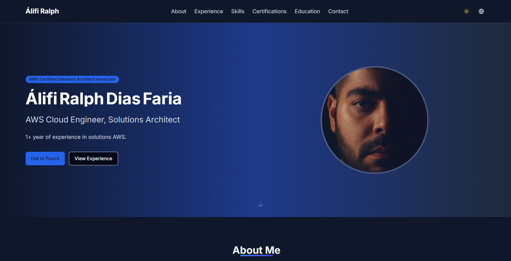

# Alifi Ralph - Portfolio Website



A modern, animated, tech-inspired portfolio website built with Next.js and Framer Motion.

## 📋 Description

This project is a personal portfolio website for Alifi Ralph, an AWS Cloud Engineer and Solutions Architect. The website showcases professional experience, skills, certifications, and contact information in a visually engaging format with modern animations and a tech-inspired aesthetic.

The portfolio is designed to be:
- Fully responsive across all device sizes
- Animation-rich with smooth transitions
- Performance-optimized
- Accessible and SEO-friendly
- Easy to customize and extend

## 🚀 Live Demo

Visit the live portfolio at: [https://alifiralph.vercel.app/](https://portfolio-alifi-ralph.vercel.app/)

## ✨ Features

- Dynamic page transitions and animations
- Interactive particle background
- Animated skill cards and timeline
- Responsive design
- Dark mode support
- Tech-inspired visual elements
- Optimized performance

## 🛠️ Technologies Used

- **Framework**: [Next.js](https://nextjs.org/)
- **Language**: [TypeScript](https://www.typescriptlang.org/)
- **Styling**: [Tailwind CSS](https://tailwindcss.com/)
- **Animations**: [Framer Motion](https://www.framer.com/motion/)
- **UI Components**: [shadcn/ui](https://ui.shadcn.com/)
- **Icons**: [Lucide React](https://lucide.dev/)
- **Deployment**: [Vercel](https://vercel.com/)

## 📦 Installation & Setup

### Prerequisites

- Node.js 18.x or later
- npm or yarn

### Installation Steps

1. Clone the repository:
   ```bash
   git clone https://github.com/oalifiralph/portfolio.git
   cd portfolio
